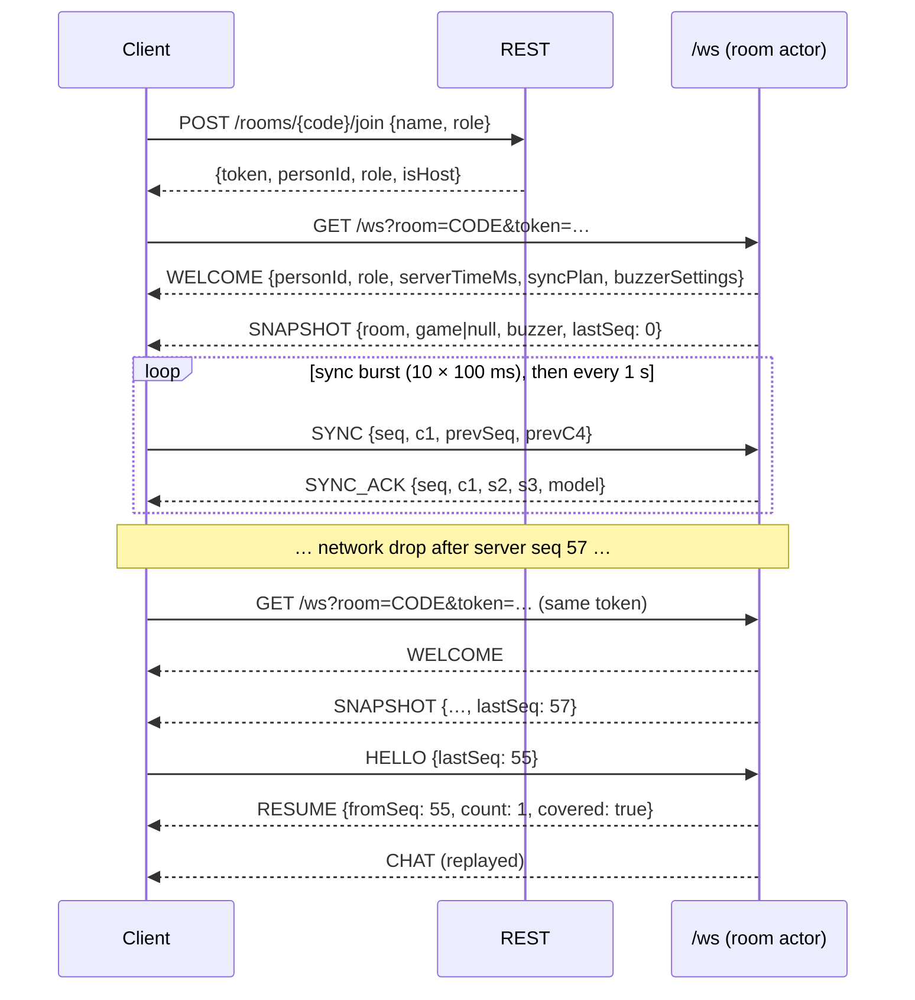
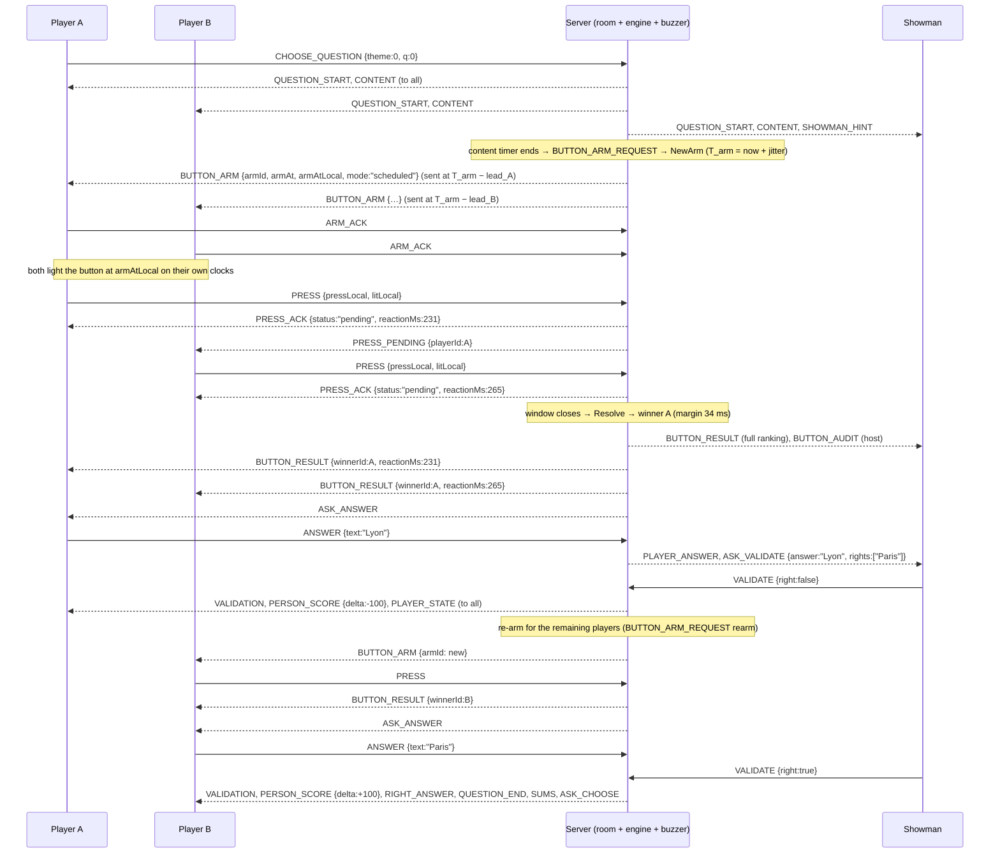
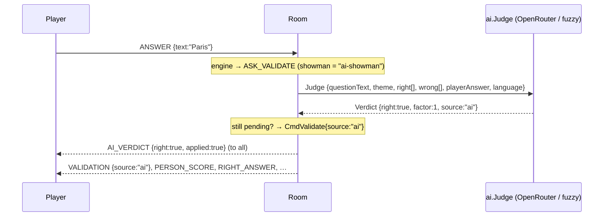

# WebSocket protocol — rooms, connections, buzzer

This document describes the real-time protocol of the SIGame server: how a client joins a room and
opens the socket, the envelope format, the room-level messages (connection lifecycle, chat, buzzer,
AI verdicts) and how to implement a fair buzzer client. Game events (`STAGE`, `TABLE`, `ASK_ANSWER`,
`VALIDATION`, …) are the engine's events forwarded 1:1; they are specified in
[`protocol-engine.md`](protocol-engine.md). The buzzer algorithm itself is in [`buzzer.md`](buzzer.md).

Source of truth for payload fields: `internal/room/messages.go` (room messages),
`internal/engine/event.go` (game events), `internal/buzzer/arm.go` and `conn.go` (buzzer payloads).

## 1. Connection lifecycle

```
POST /api/v1/rooms                 → {room, hostToken}          (creator keeps hostToken)
POST /api/v1/rooms/{code}/join     → {token, personId, role, isHost, roomCode}
GET  /ws?room={code}&token={token} → WebSocket
```

1. **Create** a room over REST (pack, rules, times, buzzer settings, showman mode). The response carries
   a `hostToken`; whoever presents it in `X-Host-Token` when joining becomes the host (once), and it
   authorises the host REST calls (settings, kick/ban, buzz log, close).
2. **Join** with a name and a role (`showman`, `player`, `viewer`) → a session token. One session =
   one person. Re-joining with the same name and role while that person is disconnected returns a new
   token for the same person (reconnect by name, score kept).
3. **Connect** to `/ws?room=CODE&token=SESSION`. The server immediately sends:
   - `WELCOME` — identity, server clock, sync plan, buzzer settings;
   - `SNAPSHOT` — the authoritative state: room info, the role-projected game snapshot (`null` in the
     lobby) and the buzzer state; `lastSeq` is the last seq sent on your previous connection.
4. **Resume** (optional): send `HELLO{lastSeq}` with the last seq you processed on the previous
   connection. The server answers `RESUME{fromSeq,count,covered}` followed by `count` replayed
   envelopes. Only conversational/progress messages are replayed (`CHAT`, `LOCKOUT`, `TIMER_*`);
   everything else is already reflected in the `SNAPSHOT`, which is authoritative.
5. A person has **one live connection**. Opening a second one replaces the first: the old socket gets
   `SESSION_REPLACED` and close code `4001`.
6. Start the **SYNC** schedule right after `WELCOME` (see §6) and keep it running for the whole session.

### Close codes

| code | meaning |
|---|---|
| 1000 | normal (room closed by the host / TTL, client left) |
| 1001 | server shutting down (`ROOM_CLOSED{reason:"shutdown"}` precedes it) |
| 1008 | policy: slow consumer (outbound queue full), rate limit exceeded, write failure |
| 4000 | unknown room or session token (an `ERROR{code:"badToken"}` precedes it) |
| 4001 | session replaced by a newer connection |
| 4002 | kicked (`KICKED{banned}` precedes it) |

### Sequence diagram: join and resume



## 2. Envelope

Every frame in both directions is a UTF-8 JSON text frame:

```json
{"t": "TYPE", "seq": 12, "p": { ... }}
```

- `t` — `SCREAMING_SNAKE` message type (`^[A-Z][A-Z0-9_]{0,63}$`).
- `seq` — **server → client**: per-connection monotonic counter starting at 1 (use it for
  `HELLO{lastSeq}` and dedup). **client → server**: your own monotonic counter; the server echoes it
  in `ERROR.ref` so you can match errors to requests. Optional (`0`/absent).
- `p` — payload object; absent when the message has none.

Limits: a frame is at most 64 KiB (`SIGAME_WS_MAX_MESSAGE_BYTES`); compression is off; media never
travels over the socket (URLs only). Clients may send at most `SIGAME_WS_MESSAGES_PER_SEC` messages
per second sustained (burst 2×); excess messages are dropped with `ERROR{code:"rateLimited"}` and 20
consecutive violations close the socket with 1008. Chat is additionally limited to 1 message/s.

### ERROR

```json
{"t":"ERROR","seq":41,"p":{"code":"badState","message":"engine: bad state: no question","ref":17}}
```

| code | when |
|---|---|
| `notAllowed` | your role/host status does not permit the action |
| `badState` | the game is not in a state that accepts the action (also "game not started") |
| `badArgument` | a field is invalid (unknown player, cell already played, …) |
| `unknownType` | unknown `t` |
| `badPayload` | the envelope or payload could not be decoded |
| `rateLimited` | too many messages / chat lines |
| `badToken` | (transport) unknown room or session; followed by close 4000 |

Errors never change state. Room-originated commands that arrive stale (a timeout for a cancelled timer,
a buzzer decision for a closed button) are ignored silently.

## 3. Client → server messages

Game commands map 1:1 to engine commands (`docs/protocol-engine.md`, "Commands"); the room adds
`Actor{personId, role, isHost}` from the session. All field names are camelCase.

| `t` | payload | who | notes |
|---|---|---|---|
| `HELLO` | `{"lastSeq":57}` | any | optional first message; requests a replay |
| `SYNC` | `{"seq":3,"c1":1012.4,"prevSeq":2,"prevC4":912.9}` | any | clock sync sample; `prevC4` = `performance.now()` when the ACK of `prevSeq` arrived |
| `ARM_ACK` | `{"armId":"…","recvLocal":5120.1}` | player | acknowledges `BUTTON_ARM` |
| `PRESS` | `{"armId":"…","seq":1,"pressLocal":5381.6,"litLocal":5150.0,"src":"pointer"}` | player | button press, stamped on the client clock |
| `MISFIRE` | `{"armId":"…"}` | player | pressed before the light (client-detected false start) |
| `VISIBLE` | `{}` | any | tab became visible again (the model is marked cold) |
| `CHAT` | `{"text":"hi"}` | any | ≤ 500 chars, 1/s |
| `READY` | — | player | toggles the ready flag |
| `START` | — | host / showman | starts the game (lobby) |
| `CHOOSE_QUESTION` | `{"theme":0,"q":2}` | chooser | 0-based indexes |
| `PASS` | — | player | give up the button / pass in bidding |
| `ANSWER` | `{"text":"Paris"}` \| `{"optionLabel":"B"}` \| `{"number":1812}` \| `{"point":{"x":0.4,"y":0.6}}` \| `{"right":true}` | answerer | `personId` in oral mode (showman answers for a player) |
| `ANSWER_DRAFT` | `{"text":"Par"}` | answerer | live typing preview for the showman |
| `VALIDATE` | `{"personId":"…","right":true,"factor":0.5,"factorZero":false}` | showman | `factor` 0 means 1 unless `factorZero` |
| `SELECT_PLAYER` | `{"personId":"…"}` | showman / chooser | ties, secret transfer |
| `SET_STAKE` | `{"stakeMode":"stake","amount":300}` | asked player | modes `nominal`, `stake`, `allIn`, `pass` |
| `DELETE_THEME` | `{"theme":2}` | asked player | final round |
| `APPELLATE` | `{"for":true}` | player | `true` = "I am right", `false` = "I disagree" |
| `VOTE_APPEAL` | `{"right":true}` | voter | |
| `MEDIA_LOADED` | — | player | informational |
| `MEDIA_COMPLETED` | — | player | media of unknown duration finished |
| `PAUSE` | `{"on":true}` | showman / host | |
| `MOVE` | `{"dir":1,"round":0}` | showman / host | −2 round back, −1 return question, 1 next, 2 next round, 3 go to `round` |
| `TOGGLE` | `{"theme":0,"q":1}` | showman / host | remove / restore a cell |
| `CHANGE_SCORE` | `{"personId":"…","newSum":500}` | showman / host | |
| `SET_CHOOSER` | `{"personId":"…"}` | showman / host | |
| `SET_OPTIONS` | `{"options":{"oral":true,"falseStart":false}}` | host / showman | `engine.RulesPatch` |
| `NEXT` | — | showman / host | advance a waiting point (managed mode) |
| `KICK` | `{"personId":"…","ban":true}` | host | `KICKED` + close 4002 for the target |
| `SET_HOST` | `{"personId":"…"}` | host | transfers host rights (`HOST_CHANGED` broadcast) |
| `BUTTON_REOPEN` | `{"armId":"…"}` | host | replaces the open arm with a fresh one (same question) |
| `SET_TRUST` | `{"personId":"…","level":"serverOnly"}` | host | overrides the trust ladder; empty level = automatic |

## 4. Server → client room-level messages

Game events use their engine type as `t` (see `protocol-engine.md`, "Events"). The messages below are
produced by the room itself.

### Lifecycle

`WELCOME` — first message of every connection.

```json
{"t":"WELCOME","seq":1,"p":{
  "personId":"0192…","name":"Alice","role":"player","isHost":false,"roomCode":"K7Q2M","showman":"human",
  "serverTimeMs":183422.7,"serverWallMs":1789430000123,
  "syncPlan":{"burst":10,"intervalMs":100,"steadyMs":1000},
  "buzzerSettings":{"mode":"anchoredHybrid","netProfile":"wifi", "…":"…"}}}
```

`serverTimeMs` is the server's monotonic clock; `armAt`, `deadlineAt`, `untilAt`, `s2/s3` are all on
that clock. `serverWallMs` is Unix time (for chat timestamps).

`SNAPSHOT` — authoritative state after `WELCOME`.

```json
{"t":"SNAPSHOT","seq":2,"p":{
  "room":{"id":"…","code":"K7Q2M","name":"Friday","packId":"…","packName":"Trivia","status":"playing",
          "showman":"human","hasPassword":false,"players":[{"id":"…","name":"Alice","role":"player","connected":true,"score":300,"isHost":false}],
          "viewers":0,"maxPlayers":12,"allowViewers":true,"joinMode":"any","rules":{"…":"…"},"times":{"…":"…"},"buzzer":{"…":"…"},
          "createdAt":1789430000000,"updatedAt":1789430050000},
  "game":{"role":"player","personId":"…","stage":"question","sub":"buttonWait","roundIndex":0,"table":{"…":"…"},"players":[],"scores":[],"timers":[],"question":{"…":"…"}},
  "buzzer":{"state":"armed","armId":"…","armAt":183900.2,"deadlineAt":188900.2,"lockedUntil":0},
  "lastSeq":57}}
```

`buzzer.state` is `idle`, `armed`, `collecting`, `draining` or `resolved`. After a reconnect the clock
model is reset, so `armAtLocal` is absent: if `state` is `armed` and `armAt` is in the past, light the
button immediately (the press will be scored server-side, "onReceipt").

`RESUME{fromSeq,count,covered}` — answer to `HELLO`; `count` replayed envelopes follow.

`ROOM_PERSONS{persons:[PersonView]}` — everyone in the room (showman, players, viewers) with
`connected` and `isHost`; broadcast on join/leave/connect/disconnect/host change. During a game the
engine's `PLAYERS` event carries seats and scores.

`ROOM_SETTINGS{…Info}` — broadcast after a host settings change.

`HOST_CHANGED{personId}` — a new host.

`CHAT{personId,name,text,atMs}` — chat line (`atMs` Unix ms).

`KICKED{banned}` — sent to the kicked person right before close 4002.

`SESSION_REPLACED{}` — sent to the old connection right before close 4001.

`ROOM_CLOSED{reason}` — `host`, `ttl` or `shutdown`; the socket closes right after.

### Buzzer

`SYNC_ACK{seq,c1,s2,s3,model}` — answer to `SYNC`. `model` is the public clock model
(`offsetMs`, `rttRefMs`, `rttWsMs`, `rttKernelMs`, `sigmaMs`, `tolMs`, `uMs`, `leadMs`, `quality`,
`flags`, `samples`). `serverTime = performance.now() + offsetMs`.

`BUTTON_ARM{armId,armAt,armAtLocal,mode,deadlineAt,lockoutMs}` — sent to each eligible player at its
own planned time (`lead` ms before the light). `mode` is `scheduled` (light at `armAtLocal` on your
clock) or `onReceipt` (light immediately; unsynced or high-RTT players).

`PRESS_ACK{armId,status,reason,lockoutUntil,reactionMs}` — answer to `PRESS`. `status` is one of
`pending`, `rejected`, `duplicate`, `late`, `stale`, `lockedOut`, `tooEarly`, `falseStart`.

`PRESS_PENDING{armId,playerId}` — broadcast when a press entered the fairness window.

`BUTTON_RESULT` — the decision. Showman and host receive the full `buzzer.Result`
(`armId`, `winnerId`, `kind`, `contested`, `tieBreak`, `rule`, `marginMs`, `ranking[]`, `tie[]`,
`resolvedAt`, `collectMs`, `seed`). Players and viewers receive the public variant:

```json
{"t":"BUTTON_RESULT","seq":88,"p":{"armId":"…","winnerId":"…","kind":"winner","contested":false,
  "marginMs":41.3,"rule":"single","reactionMs":231.4,"source":"client"}}
```

`reactionMs`/`source` are the receiving player's own press (absent when they did not press).

`LOCKOUT{playerId,untilAt,durationMs,reason}` — broadcast on `falseStart`, `tooEarly` or `misfire`.

`CONN_QUALITY{players[]{playerId,quality,connected,rttMs,jitterMs,uMs,flags,trust}}` — every 5 s
(configurable). Players/viewers get `rttMs/jitterMs/uMs` only when the room's `showPing` setting is
on; `flags` and `trust` go to the showman and host only.

`BUTTON_AUDIT{armId,questionId,seed,tArm,entries[]}` — to the host after every resolved arm: every
press evaluation (`playerId`, `status`, `tRecv`, `tArr`, `tClient`, `lo`, `hi`, `credit`, `tFinal`,
`reaction`, `source`, `flags`, `model`). The same records are available over REST (buzz log).

### AI showman

`AI_VERDICT{personId,right,factor,uncertain,reason,source,applied}` — an automatic verdict.
`applied:true` means it was applied (`ai` mode, hybrid timeout, or the fuzzy fallback after
`VALIDATION_TIMEOUT`, in which case `VALIDATION.source` is `ai` or `auto`); `applied:false` (staff
only) is a hybrid-mode suggestion that the human showman may override before `hybridConfirmMs`
elapses (the engine's `AI_SUGGESTION` event carries the same information to the showman).

## 5. Sequence diagrams

### A simple question: press, wrong answer, re-arm, right answer



When nobody presses within `pressWindowMs`, the arm resolves with `kind:"nobody"`, the engine reveals
the answer (`RIGHT_ANSWER`) and the question ends.

### AI-showman validation



In `hybrid` mode the verdict first reaches the human showman as `AI_SUGGESTION` (+ `AI_VERDICT
{applied:false}` to staff); without a human `VALIDATE` within `hybridConfirmMs` (default 8 s) the room
applies it. In `human` mode nothing is automatic except the engine's `VALIDATION_TIMEOUT` (showman
decision timer, 30 s by default), which the room answers with the deterministic fuzzy judge
(`VALIDATION.source:"auto"`). An `uncertain` verdict is a rejected answer without penalty
(`factor:0`), or with the normal penalty when the server runs with `FuzzyUncertainAsWrong`.

## 6. Client implementation guide: the buzzer

The fairness model measures your reaction on **your own clock**, from the instant the light was
scheduled to appear, and bounds what a dishonest client can gain with transport measurements the
browser cannot forge (WebSocket ping/pong, kernel RTT). An honest client therefore only has to be
*accurate*: light the button exactly at `armAtLocal`, stamp the press exactly at `pointerdown`, and
keep the clock model warm.

### 6.1 Clock sync (`SYNC`)

Send `SYNC` right after `WELCOME` as a burst (`syncPlan.burst` messages every `syncPlan.intervalMs`),
then every `syncPlan.steadyMs`; send another burst when the tab becomes visible again (after
`VISIBLE`) and a short burst of 5 when `QUESTION_START` arrives (the pre-arm burst). Samples are
interleaved: the arrival time of ACK *n* travels inside SYNC *n+1*.

```js
let syncSeq = 0, prev = null;
function sendSync() {
  const msg = { seq: ++syncSeq, c1: performance.now() };
  if (prev) { msg.prevSeq = prev.seq; msg.prevC4 = prev.c4; }
  ws.send(JSON.stringify({ t: "SYNC", seq: nextSeq(), p: msg }));
}
function onSyncAck(p) {              // {seq, c1, s2, s3, model}
  prev = { seq: p.seq, c4: performance.now() };   // stamp immediately, before any other work
  model = p.model;                                 // offsetMs, rttRefMs, quality, uMs …
}
```

Use `performance.now()` everywhere (never `Date.now()`: it jumps with NTP and manual changes). Never
"help" the measurement: do not delay, batch or throttle SYNC/ACK handling, and do not run heavy work
on the main thread during a question — the server compares your samples with anchors it measures
itself and flags inconsistencies (`sync_lie`, `rtt_inflated`, `jitter_inflated`), which lower your
trust level.

### 6.2 Lighting the button (`BUTTON_ARM`)

`BUTTON_ARM` arrives `lead` ms before the light. Acknowledge it at once and schedule the light on
your clock:

```js
function onButtonArm(p) {            // {armId, armAt, armAtLocal, mode, deadlineAt, lockoutMs}
  ws.send(JSON.stringify({ t: "ARM_ACK", seq: nextSeq(), p: { armId: p.armId, recvLocal: performance.now() } }));
  arm = { ...p, lit: false, litLocal: 0, pressSeq: 0 };
  if (p.mode === "onReceipt") { light(); return; }
  const delay = p.armAtLocal - performance.now();
  if (delay <= 0) { light(); return; }
  // coarse wait with setTimeout, then spin on requestAnimationFrame for the last frame
  setTimeout(() => {
    const tick = () => (performance.now() >= p.armAtLocal ? light() : requestAnimationFrame(tick));
    tick();
  }, Math.max(0, delay - 20));
}
function light() {
  if (arm.lit) return;
  arm.lit = true;
  arm.litLocal = performance.now();  // the instant you actually changed the DOM
  button.classList.add("lit");
}
```

`litLocal` is reported with the press; when the light was late because `BUTTON_ARM` was delayed, the
server credits the difference (bounded by `lateLightCreditMs` and by what it observed in your
`ARM_ACK`). Disarm the local state at `deadlineAt` (server clock: `deadlineAt - model.offsetMs` on
yours) or when `BUTTON_RESULT`/`QUESTION_END` arrives.

### 6.3 Pressing

Stamp the press in the `pointerdown` (or `keydown`) handler itself, before anything else:

```js
button.addEventListener("pointerdown", (ev) => {
  const pressLocal = performance.now();
  if (!ev.isTrusted) return;                       // synthetic events are never sent
  if (!arm) return;                                // no question armed
  if (!arm.lit) {                                  // pressed before the light: report the misfire
    ws.send(JSON.stringify({ t: "MISFIRE", seq: nextSeq(), p: { armId: arm.armId } }));
    lockLocally(arm.lockoutMs);
    return;
  }
  if (arm.pressSeq) return;                        // one press per arm
  ws.send(JSON.stringify({ t: "PRESS", seq: nextSeq(), p: {
    armId: arm.armId, seq: ++arm.pressSeq, pressLocal, litLocal: arm.litLocal, src: ev.pointerType ? "pointer" : "key" } }));
});
```

Show the `PRESS_ACK`: `pending` means the press is in the race; `late`/`stale`/`duplicate` explain a
lost press; `falseStart`/`tooEarly` come with `lockoutUntil` (server clock) — grey the button until
then. `LOCKOUT` broadcasts let everyone see who jumped the gun.

### 6.4 Visibility and focus

Background tabs throttle timers to ≥ 1 s and freeze `requestAnimationFrame`, so a hidden tab cannot
light the button on time. On `visibilitychange` → visible, send `VISIBLE` and a new SYNC burst; the
server marks the model cold and arms you `onReceipt` until 5 fresh samples arrive (`quality` goes
from `unsynced` back to `good`/`fair`). Show `model.quality` and `±model.uMs` next to the button so
players understand why an unsynced device is scored on arrival.

### 6.5 What the server checks

Per press the server computes the most generous reaction consistent with its own facts
(receive time, reference RTT, the time it sent your `BUTTON_ARM`): reactions below `minHumanMs`
(100–300 ms, host setting) are rejected as superhuman, presses before the light are false starts, and
client stamps are trusted only inside `±tol` around the rewound arrival time (`tolCapMs`, 40–80 ms).
Repeated inconsistencies lower the trust level (`full` → `conservative` → `serverOnly` →
`arrivalOnly`), visible to the host in `CONN_QUALITY` and `BUTTON_AUDIT`. Details: `buzzer.md`.
